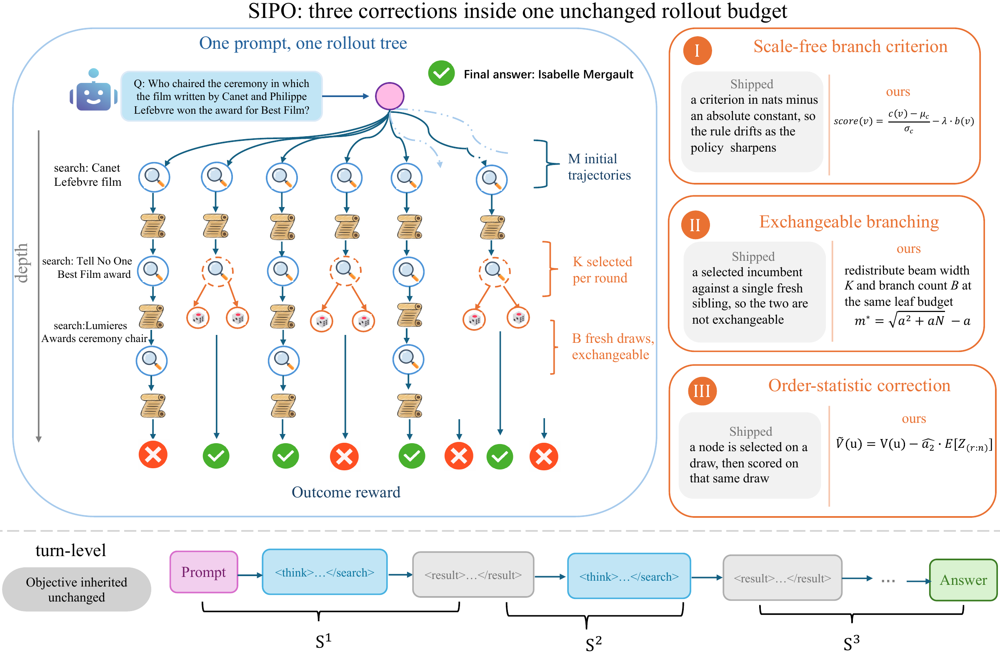

# SIPO



Full source for SIPO training and evaluation with tool-augmented language models.
The repository includes the training framework, tree rollout and credit assignment,
policy losses, reward functions, data preparation, local retrieval service,
checkpoint resume/export, and runnable configuration. Model weights, datasets,
retrieval indexes, and experiment outputs are supplied separately.

## Repository layout

| Path | Contents |
| --- | --- |
| `configs/sipo.yaml` | Complete SIPO training configuration |
| `scripts/train.py` | Training and checkpoint-resume launcher |
| `scripts/evaluate.py` | Greedy tool-enabled evaluation |
| `scripts/model_merger.py` | Export sharded checkpoints to model format |
| `verl/trainer/` | Distributed trainer, optimization, validation, and checkpointing |
| `verl/workers/` | FSDP workers, policy updates, vLLM rollout, and tool execution |
| `verl/workers/rollout/vllm_rollout/vllm_rollout_with_tools_tree_offline.py` | SIPO candidate scoring, branch expansion, OSC, and token credit assignment |
| `verl/workers/rollout/vllm_rollout/tree_stats_dump.py` | Optional tree diagnostics |
| `verl/utils/reward_score/deep_research_em.py` | Answer extraction, formatting checks, and exact-match reward |
| `verl/models/`, `verl/third_party/`, `verl/single_controller/` | Model adapters and distributed execution support |
| `data_process/` | Multi-hop and single-hop dataset preparation |
| `rag_server/` | Retrieval-resource download and FAISS retrieval server |
| `tests/` | CPU checks of the release interfaces |

## Installation

Use Linux, Python 3.10, and a CUDA environment compatible with PyTorch 2.6.0.
The default training configuration uses one node with eight GPUs. The experiments
used eight NVIDIA A800 GPUs. Retrieval also needs resources for its encoder and
large FAISS index; configure its device visibility separately.

Create an environment and install the framework from the repository root:

```bash
python -m venv .venv
source .venv/bin/activate
python -m pip install --upgrade pip wheel 'setuptools>=68,<81'
python -m pip install torch==2.6.0
python -m pip install -r requirements.txt
python -m pip install --no-build-isolation -r requirements-gpu.txt
python -m pip install --no-deps -e .
```

FlashAttention requires a compatible CUDA toolkit/compiler. Versions in the
requirements files are taken from the training environment where available.
The documented training path is FSDP with vLLM 0.8.4; retained optional framework
backends such as Megatron and SGLang require their own dependencies.

## Prepare datasets

Place FlashRAG-style JSONL splits under `data/raw/<dataset>/<split>.jsonl`.
Each record must include `question` and `golden_answers` (a list of accepted
answers). The preprocessing scripts preserve the search prompt and the
training reward schema.

Multi-hop training uses HotpotQA. The merged evaluation input contains
HotpotQA, 2WikiMultiHopQA, MuSiQue, and Bamboogle:

```bash
python data_process/hotpotqa_multihop_train.py \
  --input-dir data/raw --local_dir data/multihop
python data_process/multihop_test_merge.py \
  --input-dir data/raw --local_dir data/multihop
```

Single-hop training uses Natural Questions, with NQ, TriviaQA, and PopQA for
the merged evaluation input:

```bash
python data_process/nq_singlehop_train.py \
  --input-dir data/raw --local_dir data/singlehop
python data_process/singlehop_test_merge.py \
  --input-dir data/raw --local_dir data/singlehop
```

Both workflows produce `train.parquet` and `test.parquet`. The merge script
replaces the single-dataset `test.parquet` with the combined evaluation data.
It chooses `test` when available, otherwise `dev`, otherwise `train`, matching
the included preprocessing logic. Supply the intended benchmark splits.
Use `--data_sources` with a comma-separated list to select evaluation subsets.

## Start retrieval

Use a separate environment with PyTorch, **GPU-enabled FAISS**, and
`requirements-retriever.txt`. The server uses FAISS GPU cloning and a CUDA
encoder; `faiss-cpu` alone does not support this path. Install a FAISS GPU
build compatible with that environment's CUDA libraries.

The public Wikipedia retrieval files can be prepared with:

```bash
python rag_server/download.py --save-path data/retrieval
```

This downloads the two index parts and compressed corpus, then assembles
`e5_Flat.index` and `wiki-18.jsonl`. Sufficient disk space and host/GPU memory
are required for these large resources. Place the matching E5 retriever model
under `models/e5-base-v2`, then start the server:

```bash
python rag_server/retrieval_server.py \
  --index_path data/retrieval/e5_Flat.index \
  --corpus_path data/retrieval/wiki-18.jsonl \
  --retriever_model models/e5-base-v2 \
  --host localhost --port 8000
```

The training client uses a configurable hostname and port. It retrieves three
passages per query and preserves the original passage deduplication, truncation,
and formatting. No service address or authentication credential is bundled.
The default tool configuration enables search. The Python tool implementation
is retained in the framework but is not enabled by this configuration.

## Train

Run commands from the repository root, with retrieval already running. Put a
model such as Qwen2.5-7B-Instruct, Qwen3-4B, or Qwen3-8B in a local directory,
or use a public model identifier supported by Transformers.

```bash
python scripts/train.py \
  --model models/Qwen2.5-7B-Instruct \
  --train-data data/multihop/train.parquet \
  --val-data data/multihop/test.parquet \
  --output runs/qwen25-7b-multihop \
  --name qwen25-7b-multihop
```

For single-hop experiments, change both dataset paths to `data/singlehop/`.
Use the same launcher with the appropriate model directory for the other models.
Add `--dry-run` to inspect the command without loading a model or starting a run.

The default configuration uses 240 training steps, evaluation every 20 steps,
checkpointing every 40 steps, training batch size 64, PPO mini-batch size 8,
and prompt/response limits of 2,000/6,192 tokens. SIPO uses 10 initial rollouts,
two expansion rounds, three selected expansion slots, and two new branches per
slot, for a nominal budget of 22 leaves per prompt. The OSC weight is 1.

Additional Hydra settings can be supplied without editing the launcher:

```bash
python scripts/train.py \
  --model models/Qwen2.5-7B-Instruct \
  --train-data data/multihop/train.parquet \
  --val-data data/multihop/test.parquet \
  --output runs/smoke --steps 1 --eval-every 1 --save-every 1 \
  --override ray_init.num_cpus=16
```

This is a real one-step training run and still requires the model, data,
retrieval service, and GPUs. Use `--gpus` to select a GPU count and
`CUDA_VISIBLE_DEVICES` to select devices. Batch sizes and tensor parallelism
must remain compatible with the selected world size. For memory tuning,
override `actor_rollout_ref.rollout.gpu_memory_utilization` or
`actor_rollout_ref.actor.fsdp_config.optimizer_offload`.

Metrics and configuration are written locally to `<output>/logs/`, console
output to `<output>/run.log`, and checkpoints to `<output>/checkpoints/`.
Use a fresh output directory for a fresh run. `--dump-rollouts` also saves
generated training and evaluation trajectories. Local JSONL and console
logging are enabled by default; TensorBoard is optional.

## Resume, evaluate, and export

Resume training with the same model, data, and training configuration:

```bash
python scripts/train.py \
  --model models/Qwen2.5-7B-Instruct \
  --train-data data/multihop/train.parquet \
  --val-data data/multihop/test.parquet \
  --output runs/qwen25-7b-multihop \
  --resume runs/qwen25-7b-multihop/checkpoints/global_step_40
```

Evaluate a saved checkpoint with the same greedy validation procedure:

```bash
python scripts/evaluate.py \
  --model models/Qwen2.5-7B-Instruct \
  --train-data data/multihop/train.parquet \
  --val-data data/multihop/test.parquet \
  --output runs/evaluation \
  --resume runs/qwen25-7b-multihop/checkpoints/global_step_40
```

Omitting `--resume` evaluates the model supplied with `--model`. The trainer
constructs its data loaders before validation, so the training Parquet is
also required for evaluation setup. Evaluation still uses the local retriever.
Validation reports exact-match accuracy and associated metrics in the local log.

Export the actor checkpoint:

```bash
python scripts/model_merger.py merge --backend fsdp \
  --local_dir runs/qwen25-7b-multihop/checkpoints/global_step_40/actor \
  --target_dir models/sipo-export
```

## Checks and implementation guide

```bash
python -m unittest discover -s tests -v
```

These CPU checks cover launcher/config integration, search requests and response
formatting, failure handling, local metric logging, the retriever response
protocol, and all four data preprocessing scripts using synthetic fixtures.
See [the implementation guide](docs/implementation.md) for the SIPO execution
path, configuration switches, and optional tree diagnostics.

The release was checked for Python syntax, configuration resolution, package
contents, and parity of the training/rollout/reward computation with the source
implementation. A new distributed GPU training run was not performed as part
of release preparation.

## License and attribution

This repository contains the modified verl training framework and bundled
upstream support code. Apache 2.0 licensing and required upstream copyright
notices are retained in `LICENSE`, `Notice.txt`, and source headers. Public
documentation and license references are retained where applicable.

The source release excludes Git history, experiment data, checkpoints, editor
state, personal contact metadata, and machine-specific service configuration.

## Citation

If you use SIPO in your research, please cite our [paper](https://arxiv.org/abs/2609.34805):

```bibtex
@misc{fu2026sipo,
  title = {{SIPO}: Selective-Inference Policy Optimization for Tree-Structured Agentic {RL}},
  author = {Fu, Zenghuang
    and Chen, Ningqi
    and Jia, Mingda
    and Han, Xiaofeng
    and Li, Zhaoyang
    and Ai, Qiuyuan
    and Zheng, Zelong
    and Wu, Haoyu
    and Fu, Tianyu
    and Zhao, Chenxu
    and Wu, Minghui
    and He, Guannan
    and Wang, Changwei},
  year = {2026},
  eprint = {2609.34805},
  archivePrefix = {arXiv},
  url = {https://arxiv.org/abs/2609.34805}
}
```
